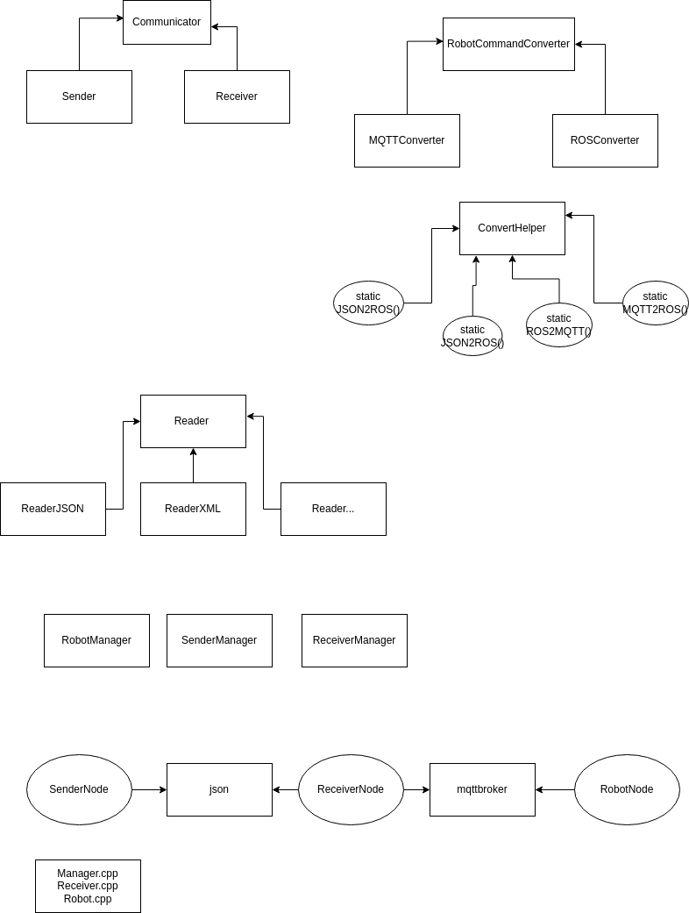

# A Server to Robot Commands Handler

## A Three Part System
- A Robot component: receives directions in MQTT, translates them into commands and executes them by printing to the console. (forward, backward, left, right, jump, stop)
Commands have a duration and a speed

- A Receiver component: receives instructions in JSON via a sub/pub event system and sends them over to the robot using  the MQTT protocol.
Instructions comprise a list of 10 commands.

- A Manager component: sends out instructions (for the sake of the assignment, have it send out instructions at the start)

## Class structure


Some sources use templates. 

## Installation
install [mqtt_client](https://github.com/ika-rwth-aachen/mqtt_client) to your ros directory (e.g. `catkin_ws/src`):  
```
  cd catkin_ws/src
  git clone https://github.com/ika-rwth-aachen/mqtt_client
  cd ../
  catkin build mqtt_client
```

change file from `launch/params.yaml` in this repo to `launch/params.yaml` of the mqtt_client repository (e.g. `catkin_ws/src/mqtt_client/launch/params.yaml`)

```
  mkdir build && cd build  
  cmake .. 
  make -j
```  

## Running
run docker mosquitto in terminal `1`:  
```
  docker run --rm --network host --name mosquitto eclipse-mosquitto
``` 
and then in terminal `2` 
 ``` 
  roslaunch mqtt_client standalone.launch 
```
then in terminal `3` 
```
  rostopic pub -r 1 mqtt  robotcorp/command "{}"
```
wait for ~5 seconds and then stop `Ctrl+C`. 
```
  rosrun robotcorp robotMain   # in terminal 3
  rosrun robotcorp receiverMain   # in terminal 4  
  rosrun robotcorp senderMain   # in terminal 5 
```

If the messages are not being published try to relaunch mosquitto and mqtt_client. If it doesn't help try to restart your computer.
